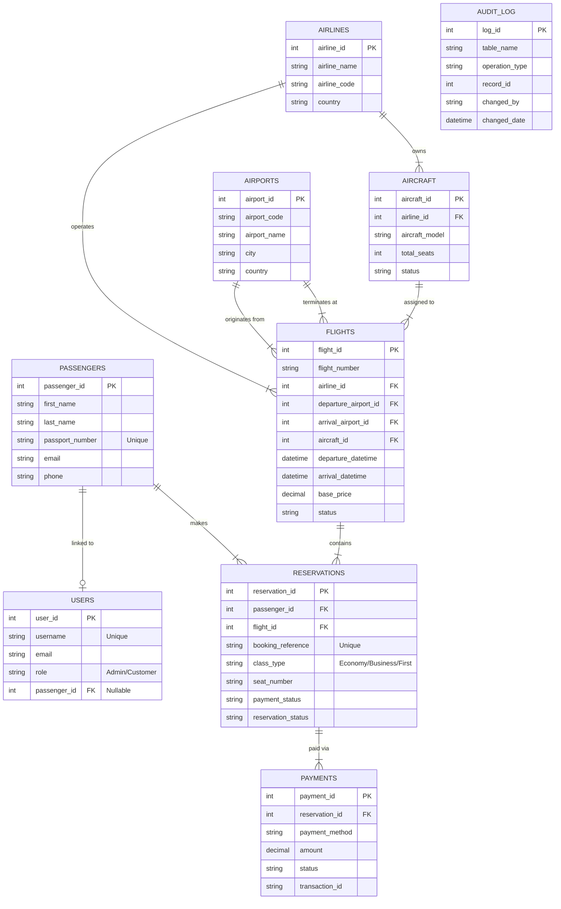

# Flight Reservation System - Entity Relationship Diagram

This diagram represents the current structure of your `FlightReservationDB` after the recent cleanup.

```mermaid
erDiagram
    %% Core Tables
    AIRLINES ||--|{ AIRCRAFT : owns
    AIRLINES ||--|{ FLIGHTS : operates
    AIRLINES {
        int airline_id PK
        string airline_name
        string airline_code
        string country
    }

    AIRPORTS ||--|{ FLIGHTS : "originates from"
    AIRPORTS ||--|{ FLIGHTS : "terminates at"
    AIRPORTS {
        int airport_id PK
        string airport_code
        string airport_name
        string city
        string country
    }

    AIRCRAFT ||--|{ FLIGHTS : "assigned to"
    AIRCRAFT {
        int aircraft_id PK
        int airline_id FK
        string aircraft_model
        int total_seats
        string status
    }

    %% User & Passenger Management
    PASSENGERS ||--o| USERS : "linked to"
    PASSENGERS ||--|{ RESERVATIONS : makes
    PASSENGERS {
        int passenger_id PK
        string first_name
        string last_name
        string passport_number "Unique"
        string email
        string phone
    }

    USERS {
        int user_id PK
        string username "Unique"
        string email
        string role "Admin/Customer"
        int passenger_id FK "Nullable"
    }

    %% Flight Operations
    FLIGHTS ||--|{ RESERVATIONS : contains
    FLIGHTS {
        int flight_id PK
        string flight_number
        int airline_id FK
        int departure_airport_id FK
        int arrival_airport_id FK
        int aircraft_id FK
        datetime departure_datetime
        datetime arrival_datetime
        decimal base_price
        string status
    }

    %% Booking & Payments
    RESERVATIONS ||--|{ PAYMENTS : "paid via"
    RESERVATIONS {
        int reservation_id PK
        int passenger_id FK
        int flight_id FK
        string booking_reference "Unique"
        string class_type "Economy/Business/First"
        string seat_number
        string payment_status
        string reservation_status
    }

    PAYMENTS {
        int payment_id PK
        int reservation_id FK
        string payment_method
        decimal amount
        string status
        string transaction_id
    }

    %% Logging
    AUDIT_LOG {
        int log_id PK
        string table_name
        string operation_type
        int record_id
        string changed_by
        datetime changed_date
    }
```
